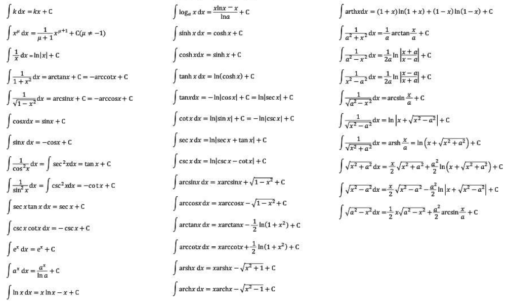
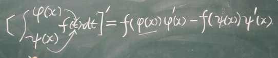

# Miao-A-Songhao-Advanced-Mathematics-Notes
宋浩老师《高等数学》同济版 网课笔记
# 高等数学
## 不定积分表

## P36 不定积分的定义
- 原函数存在定理：连续的行数一定有原函数
## P39 不定积分的性质
- d代表无穷小的△（增量）：dx = x1 - x2， d → 0
- `∫[f(x) + g(x)]dx = ∫f(x)dx + ∫g(x)dx`
- `∫kf(x)dx = k∫f(x)dx`
## P40 第一类换元积分法
- `∫f(φ(x))φ'(x)dx = ∫f(φ(x))dφ(x) = F(φ(x)) + C`
- 把d前面的某一部分（因子），求原函数，拿到d的里面去
- d的里面可以任意加减常数
## P41 第二类换元积分法
- 把x=φ(t)，换出来，最后换回x
## P42 分部积分法
- `∫udv = uv - ∫vdu`
- 优先放到后面：
  - e^x
  - sinx/cosx
## P46 微积分基本公式
- φ(x) = ∫f(t)dt|a→x => φ'(x) = f(x)

